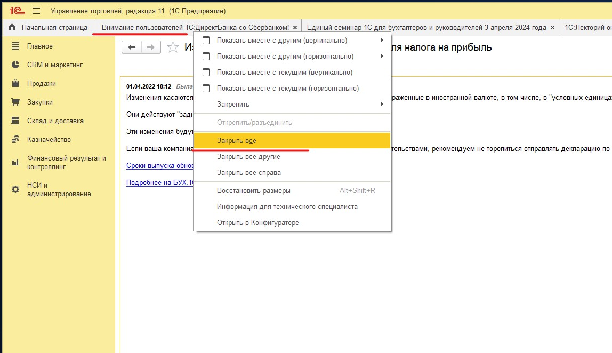
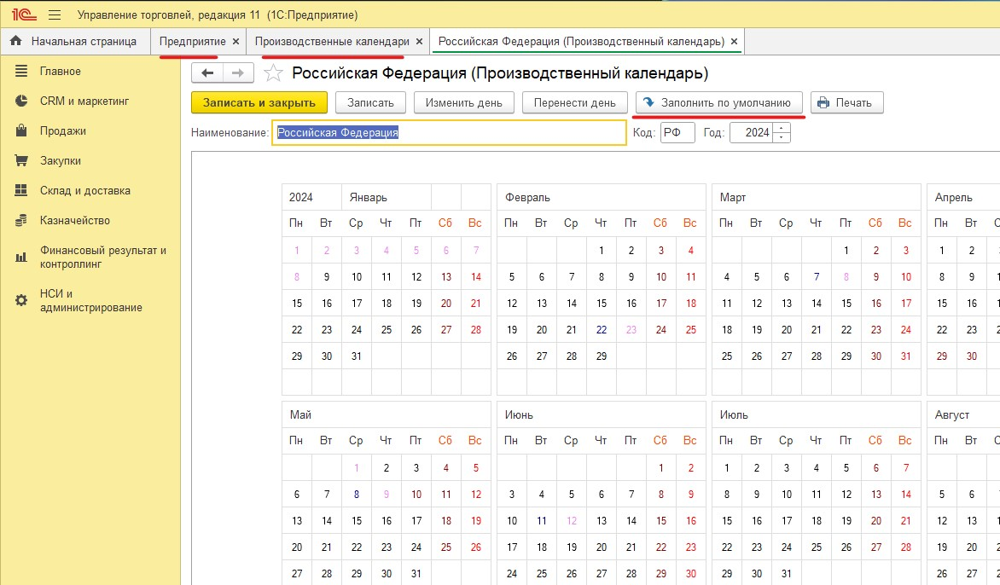
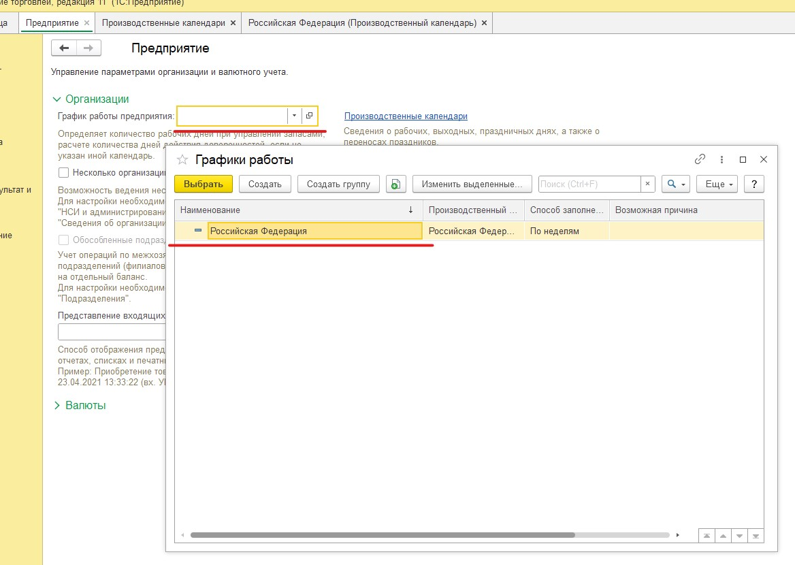

# Решение билета 1-23/2-16
## Ввод данных
### Настройка
0. При запуске открывается много служебных окон - правой кнопкой в заголовке и "закрыть все" 

1. Предприятие - Производственные календари  
1.1. Заполнить по умолчанию
  
2. Предприятие - График работы предприятия  
  
2.1. Учимся пользоваться горячими клавишами -> График работы предприятия - **F4** в открышемся окне **Ctrl+Enter** 

3. CRM и маркетинг - Маркетинг - несколько видов цен
4. CRM и маркетинг - Маркетинг - ценовые группы
  
5. Продажи - Только индивидуальные соглашения
  
6. Продажи - Заказы клиентов
7. Продажи - Заказ со склада и под заказ
  
8. Продажи - Условия и порядок оплаты - шаблоны графиков оплаты  
  
8. Финансовый результат и контроллинг - Учитывать прочие активы и пассивы
  
### Ввод НСИ

### Ввод данных
***
***
## Кофигурирование
### Настройка
### Конфигурирование
### Ввод данных